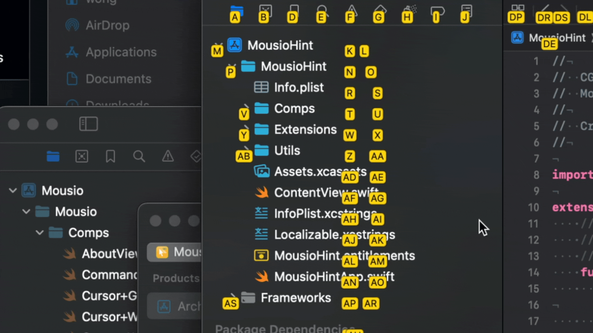
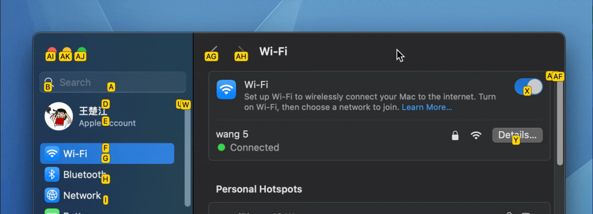

<!--idoc:ignore:start-->
> [!TIP]
> Declaration: This project is not an open-source project. The repository serves as the official website, used to collect issues and user demands. This is done to save costs, because without an official website, the application cannot pass the review.
<!--idoc:ignore:end-->

<div align="center">
  <br />
  <br />
  
  <h1>
    Mousio Hint
  </h1>
  <!--rehype:style=border: 0;-->
  <p>
    <a href="./README.zh.md">简体中文</a> • 
    <a href="https://wangchujiang.com/mousio/" target="_blank">Mousio</a> • 
    <a target="_blank" href="https://github.com/jaywcjlove/mousio/issues/new?template=bug_report.yml">Contact & Support</a> • 
    <a href="./CHANGELOG.md">Changelog</a>
  </p>
  <p>
    <a target="_blank" href="https://github.com/jaywcjlove/mousio-hint/releases/latest/" title="Mousio Hint for macOS">
      
    </a>
  </p>
</div>

```bash
$ brew install --cask jaywcjlove/tap/mousio-hint
```





**Mousio Hint** displays **keyboard shortcut hints** next to interface elements on your screen. With these hints, you can quickly move the mouse pointer to target locations using only your keyboard—no manual mouse movement required.

It works as a companion enhancement to [Mousio](https://jaywcjlove.github.io/maslink/?id=6746747327), designed to **significantly boost your system navigation efficiency through keyboard control**.

The main [Mousio](https://jaywcjlove.github.io/maslink/?id=6746747327) app supports running in sandbox mode. However, Mousio Hint **cannot function properly in a sandboxed environment** because it requires access to and location of UI elements. Please note that Mousio Hint is essentially an auxiliary positioning tool that links with Mousio through its settings.


In some applications, if the system cannot fully retrieve all UI elements, you can directly use Mousio. In such cases, the operating experience will be more akin to playing a game, giving you **precise control over the mouse cursor's position**.

By combining this with the powerful features offered by [Mousio](https://jaywcjlove.github.io/maslink/?id=6746747327), including:

- ⌨️ Keyboard scroll wheel control
- 🎯 Precise cursor movement
- 🧭 Grid navigation and focus positioning


You'll be able to achieve a highly efficient operating experience that's **almost entirely free from mouse dependency**.