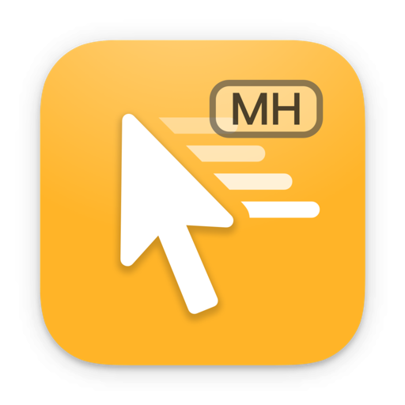
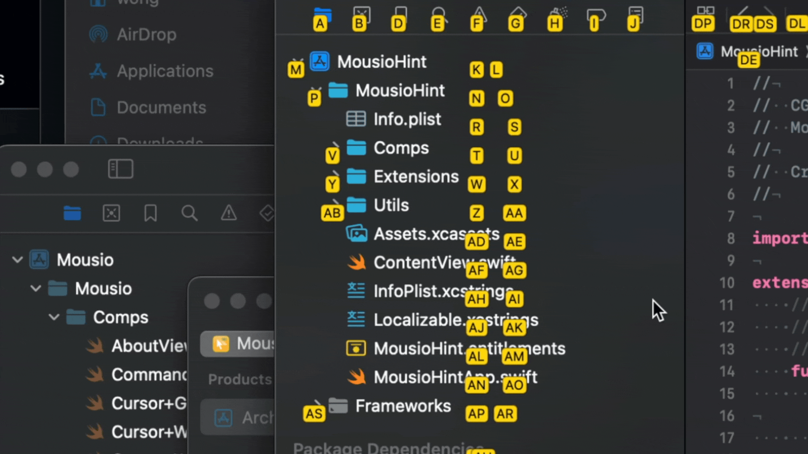
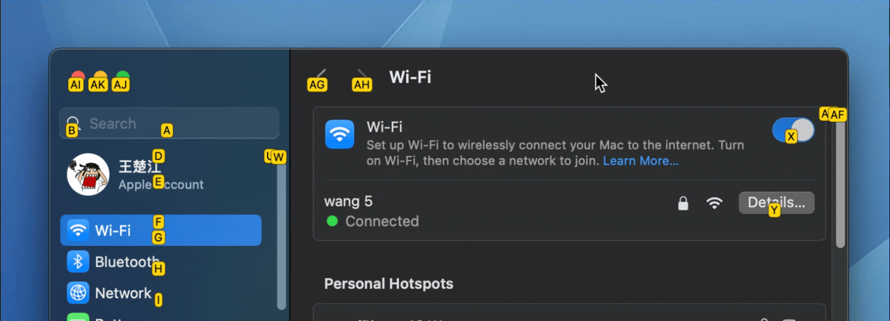

<!--idoc:ignore:start-->
> [!TIP]
> 声明：此项目并非开源项目，仓库作为官方网站，用于收集问题和用户需求。这样做是为了节省成本，因为没有官网，应用无法通过审核。
<!--idoc:ignore:end-->

   
   
  
  <h1>
    Mousio Hint
  </h1>
  <!--rehype:style=border: 0;-->
  

    <a href="./README.md">English</a> • 
    <a href="https://wangchujiang.com/mousio/" target="_blank">Mousio</a> • 
    <a target="_blank" href="https://github.com/jaywcjlove/mousio/issues/new?template=bug_report_cn.yml">联系&支持</a> • 
    <a href="./CHANGELOG.zh.md">更新日志</a>
  

  

    
  

Mousio Hint 是一款辅助增强工具，它与主应用 [Mousio](https://apps.apple.com/app/Mousio/6746747327) 协同工作，旨在**通过键盘大幅提升您的系统操作效率**。

Mousio Hint 的核心功能是在屏幕上的界面元素旁生成**快捷键提示**。通过这些提示，您可以用键盘快速将鼠标指针移动到目标位置，完全无需手动操作鼠标。

[Mousio](https://apps.apple.com/app/Mousio/6746747327) 主应用支持在沙盒模式下运行，但 Mousio Hint 因为需要访问并定位界面元素，所以**无法在沙盒环境中正常使用**。请注意，Mousio Hint 本质上是一个辅助定位工具，它通过设置与 Mousio 进行联动。

在某些应用程序中，如果系统无法完整获取所有界面元素，您可以直接使用 Mousio。在这种情况下，操作体验会更像在玩游戏，您可以**精确控制鼠标光标的位置**。

结合 [Mousio](https://apps.apple.com/app/Mousio/6746747327) 提供的以下强大功能：

- ⌨️ 键盘滚轮控制
- 🎯 光标精准移动
- 🧭 网格导航与焦点定位

您将能够实现**几乎完全脱离鼠标的高效操作体验**。
